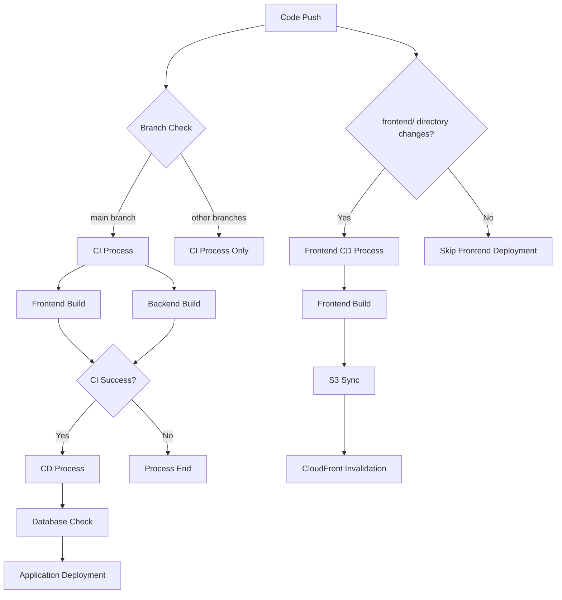

# GitHub Actions CI/CD Configuration Guide

## Overview

This project contains a complete CI/CD pipeline with three main workflows:

### CI Process (Continuous Integration)
1. **Frontend Build** - Build React application using pnpm
2. **Backend Build** - Compile .NET application and build Docker image

### Backend CD Process (Continuous Deployment)
1. **Database Check** - Detect if this is the first deployment
2. **Database Initialization** - Execute migrations and seed data on first deployment
3. **Application Deployment** - Deploy to EC2 instance
4. **Database Update** - Update database schema on subsequent deployments

### Frontend CD Process (Frontend Continuous Deployment)
1. **Frontend Build** - Build React application
2. **S3 Sync** - Sync build artifacts to S3 bucket
3. **CloudFront Cache Invalidation** - Refresh CDN cache

## Workflow Trigger Conditions

- **CI**: Triggered on every push to any branch
- **Backend CD**: Only triggered when CI succeeds and push is to `main` branch
- **Frontend CD**: Only triggered when pushing to `main` branch and `frontend/` directory has changes

## Required GitHub Secrets Configuration

### AWS Related Configuration

Add the following secrets in GitHub repository Settings > Secrets and variables > Actions:

#### 1. AWS_ROLE_ARN
- **Description**: AWS IAM Role ARN for GitHub Actions to access AWS services
- **Format**: `arn:aws:iam::123456789012:role/github-actions-role`
- **Permission Requirements**: 
  - ECR: Image push and pull permissions
  - SSM: Command execution permissions
  - STS: Authentication permissions
  - S3: Bucket read/write permissions
  - CloudFront: Cache invalidation permissions

#### 2. AWS_REGION
- **Description**: AWS region
- **Examples**: `ap-southeast-1`, `us-east-1`

#### 3. ECR_REPOSITORY_NAME
- **Description**: ECR repository name
- **Example**: `settly-backend`

#### 4. EC2_INSTANCE_ID
- **Description**: Target EC2 instance ID
- **Format**: `i-1234567890abcdef0`

#### 5. RDS_CONNECTION_STRING
- **Description**: PostgreSQL database connection string
- **Format**: `Host=your-rds-endpoint;Port=5432;Database=settly;User Id=username;Password=password;Include Error Detail=true`

#### 6. AWS_S3_BUCKET
- **Description**: Frontend static files bucket name
- **Example**: `settly-frontend-prod`

#### 7. CF_DIST_ID
- **Description**: CloudFront distribution ID
- **Format**: `E1234567890ABC`

## Detailed Workflow Process

### CI Process

#### 1. Frontend Job
- Install Node.js 22.x
- Setup pnpm 9
- Install dependencies (with cache optimization)
- Build application

#### 2. Backend Job
- Install .NET 8.0
- Compile application
- Configure AWS credentials
- Login to ECR
- Build Docker image
- Push to ECR (including commit-hash and latest tags)

### CD Process

#### 1. Database Check
- Use `dotnet ef database update --dry-run` to check if database exists
- Set `first_deployment` output variable

#### 2. Database Initialization (First Deployment)
- **Database Migration**: Create database structure
- **Data Seeding**: Populate initial data
- Execute using temporary container to avoid affecting main application

#### 3. Application Deployment
- Stop old container
- Pull latest image
- Start new container
- Configure environment variables

#### 4. Database Update (Subsequent Deployments)
- Update database schema within running container
- Do not repeat data seeding

### Frontend CD Process

#### 1. Frontend Build
- Install Node.js 22.x
- Setup pnpm 9
- Install dependencies (with cache optimization)
- Build production version

#### 2. S3 Sync
- Configure AWS credentials (OIDC)
- Sync build artifacts to S3 bucket
- Set appropriate cache control headers
- Delete old files

#### 3. CloudFront Cache Invalidation
- Create cache invalidation request
- Refresh cache for critical paths (`/index.html`, `/`)

## Unified Technology Stack Versions

To ensure consistency across all workflows, the project uses the following unified versions:

- **Node.js**: 22.x
- **pnpm**: 9
- **pnpm action**: v4
- **.NET**: 8.0.x

## Caching Strategy

### Frontend Caching
- **pnpm store**: Cache based on `pnpm-lock.yaml` hash value
- **Build artifacts**: CDN caching through S3 and CloudFront
- **Cache control**: Static resources set to 5-minute cache, HTML files invalidated immediately

### Backend Caching
- **Docker layers**: Utilize Docker layer caching to optimize build speed
- **Dependency caching**: .NET package caching

## Database Management Strategy

### First Deployment
```bash
# 1. Database migration
docker run --rm -e ApiConfigs__DBConnection="..." image:latest \
  dotnet ef database update --startup-project /app/SettlyApi --project /app/SettlyModels

# 2. Data seeding
docker run --rm -e ApiConfigs__DBConnection="..." image:latest \
  bash -c "cd /app/SettlyDbManager && dotnet run -- --seed"
```

### Subsequent Deployments
```bash
# Update schema within running container
docker exec settly-api dotnet ef database update --startup-project /app/SettlyApi --project /app/SettlyModels
```

## Image Tagging Strategy

- **commit-hash**: Unique identifier for each commit, e.g., `abc1234`
- **latest**: Latest version tag

## Environment Requirements

### EC2 Instance
- Install Docker
- Install AWS CLI
- Configure SSM Agent
- Configure appropriate IAM role

### RDS Database
- PostgreSQL instance
- Configure security groups to allow EC2 access
- Create database and user

### S3 and CloudFront
- S3 bucket configured for static website hosting
- CloudFront distribution configured to point to S3 bucket
- Appropriate CORS and caching policies

## Troubleshooting

### Common Issues

#### CI Related Issues
1. **AWS Permission Errors**: Check if IAM Role permissions are complete
2. **ECR Login Failure**: Confirm AWS_REGION and ECR_REPOSITORY_NAME are correct
3. **Build Timeout**: Check if Dockerfile is optimized and dependencies are not excessive
4. **Push Failure**: Confirm ECR repository exists and has push permissions

#### CD Related Issues
1. **SSM Command Failure**: Check if EC2 instance has SSM Agent installed
2. **Database Connection Failure**: Verify RDS_CONNECTION_STRING format and network connectivity
3. **Migration Failure**: Check database permissions and migration files
4. **Container Startup Failure**: Check environment variables and port configuration

#### Frontend CD Related Issues
1. **S3 Sync Failure**: Check AWS_S3_BUCKET and IAM permissions
2. **CloudFront Invalidation Failure**: Confirm CF_DIST_ID is correct
3. **Build Failure**: Check frontend dependencies and build scripts
4. **Cache Issues**: Verify CloudFront configuration and caching policies

### Debugging Steps

1. **Check SSM Command Execution**:
   ```bash
   aws ssm describe-instance-information --region your-region
   ```

2. **View Container Logs**:
   ```bash
   docker logs settly-api
   ```

3. **Verify Database Connection**:
   ```bash
   docker exec settly-api dotnet ef database update --dry-run
   ```

4. **Check S3 Sync Status**:
   ```bash
   aws s3 ls s3://your-bucket-name --recursive
   ```

5. **Verify CloudFront Distribution**:
   ```bash
   aws cloudfront get-distribution --id YOUR_DISTRIBUTION_ID
   ```

## Workflow Dependencies



## Best Practices

1. **Version Consistency**: Ensure all workflows use the same tool versions
2. **Cache Optimization**: Make full use of GitHub Actions and AWS caching mechanisms
3. **Minimal Permissions**: Configure minimum necessary permissions for each workflow
4. **Error Handling**: Configure appropriate error handling and retry mechanisms
5. **Monitoring Alerts**: Set up notification mechanisms for workflow failures
